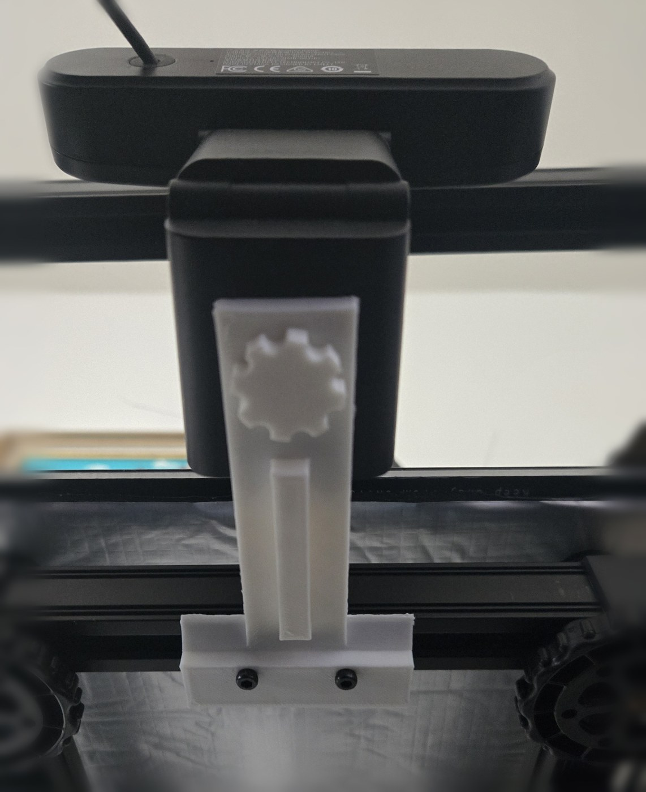
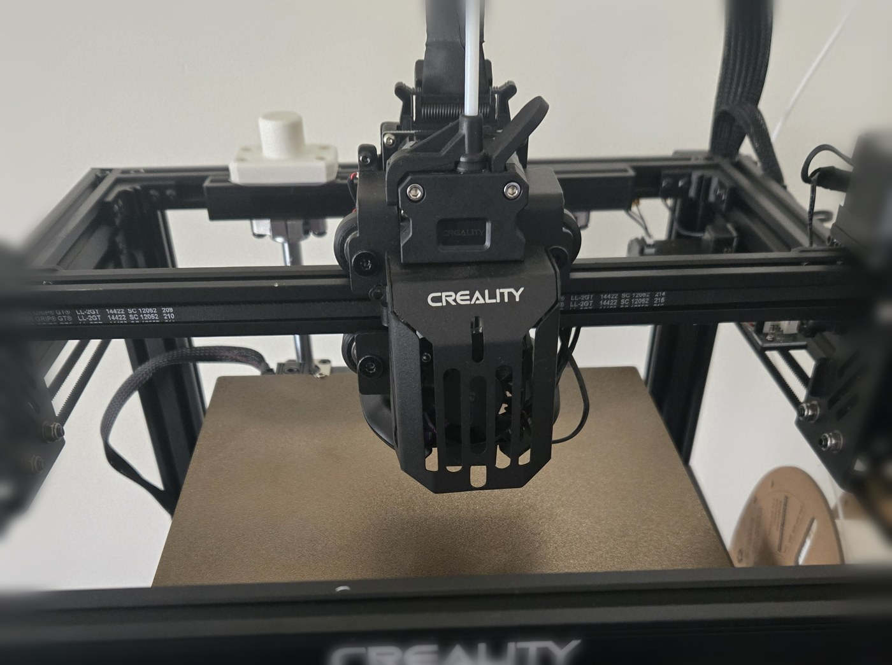

# Ender 5 (S1) webcam mount — parametric, printed thumbscrew, no metal hardware for the camera

A T-shaped 2020-extrusion webcam mount for the Creality Ender 5 / Ender 5 S1,
plus a **printed 1/4"-20 thumbscrew** so you don't need to hunt for a tripod
screw. Everything is generated from one parametric script — change the arm
length, tilt, or bolt size and re-run.



*T crossbar bolted to a 2020 rail with two M3 T-nuts; arm reaching out to the
camera; the printed thumbscrew is the knurled disc.*

The T crossbar bolts along a 2020 rail with two M3 T-nuts; the arm reaches out
perpendicular; the camera clamps to the end with the printed thumbscrew. The
raised rib along the arm is what keeps a 105 mm cantilever from drooping.

*The host machine — a Creality Ender 5 S1.*



## Why a T, and why a separate screw

Both were learned the hard way:

- **Two bolts on a 2020 face can only ever be collinear with the rail** — the
  slots run along the extrusion. So if you want the arm to point *away* from
  the rail, the bolt line has to be perpendicular to the arm. That's the T.
- **An integrated threaded post does not work.** Tried it; a post long enough
  to feel solid bottoms out in the camera's tripod socket before the camera
  seats, and a fixed post can't clamp the camera at a chosen rotation. A plain
  through-hole plus a separate screw solves both.

## Printed parts

| Part | Size |
|---|---|
| `stl/ender5-webcam-mount_Tplate.stl` | 56 × 105 × 9 mm |
| `stl/thumbscrew_quarter20.stl` | 19.5 mm head, 13.6 mm tall |

Both parts together slice to **15.4 g of PLA and about 1 h 15 m** at the
settings below. (The generator prints a heavier figure when it runs — that is
the *solid* volume, before infill.)

**Print settings** (what these were printed at): 0.16 mm layers, 0.4 mm nozzle,
15% infill, 3 perimeters, PLA at 207 °C / bed 60 °C. **No supports needed** —
the plate's entire underside is flat, and it is exported to print face-down.

> If the mount will sit near a heated bed, print it in **PETG**. PLA's glass
> transition is ~60 °C, which is exactly a typical bed temperature, and a PLA
> part clamped near the bed will creep over time. Mounted on the frame (as
> pictured) PLA is fine.

## Hardware

- **2 × M3 T-nuts** (roll-in / hammer) + **M3 bolts, 12-16 mm**. The crossbar is
  9 mm thick, so a short bolt leaves almost no thread in the nut.
- **1 × 1/4"-20 screw** for the camera — or print `thumbscrew_quarter20.stl`
  and use no metal at all.

## Verified dimensions

Measured by ray-casting the exported STLs, not taken from the CAD:

| Feature | Target | Measured |
|---|---|---|
| M3 clearance holes (×2, 24 mm apart) | 3.4 mm | 3.35 mm |
| 1/4"-20 clearance hole | 6.8 mm | 6.85 mm |
| Crossbar width | 56 mm | 56.5 mm |
| Arm width | 24 mm | 24.5 mm |
| Thumbscrew thread pitch | 1.27 mm (20 TPI) | 1.270 mm (20.0 TPI) |
| Thumbscrew major dia | 5.85 mm | 5.84 mm |

The thread is deliberately cut 0.25 mm/side under nominal 6.35 mm so a printed
thread actually turns into a metal socket. That value is confirmed by fit, not
theory. Thread length is 8 mm = 4 mm plate + 4 mm into the socket — tripod
sockets bottom out around 5-6 mm, so longer is worse, not better.

## Regenerating

Needs `trimesh` + `manifold3d` (for CSG) and `numpy`:

```bash
pip install trimesh manifold3d numpy
python3 generate.py                 # flat T-plate + thumbscrew
python3 generate.py --tilt 5        # tapered 5 deg (plate starts thicker)
```

Useful knobs at the top of `generate.py`: `PLATE_L` (arm reach), `CROSS_L`
(crossbar length), `BOLT_D` (3.4 for M3, 5.5 for M5), `BOLT_SPACING`,
`SOCKET_ENGAGE` (how far the screw enters the camera), `THREAD_SHAVE` (printed
thread fit — raise it if the screw won't start, lower it if it's sloppy).

A note on `--tilt`: a tapered plate has to *start* thicker, because 5° over
105 mm needs more drop than a 4 mm plate contains. The script handles this by
raising the mount end. In practice **flat is usually right** — most webcam arms
have their own tilt/Z adjustment, which is why the shipped STL is 0°.

## Licence

[CC BY 4.0](LICENSE) — use it, remix it, sell prints of it; just credit the
original.
